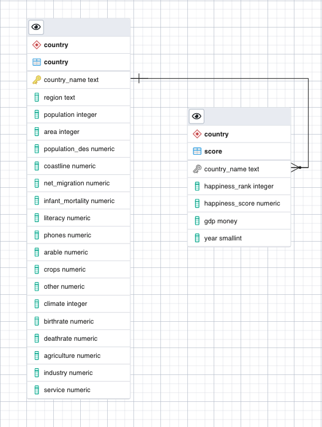

# World Happiness Report - Databases Practical Assignment

Ana Catarina Mesquita

Filipe Dória

Guilherme Salles

# 1) Download Files and Intro
Please READ the instructions and information below in order to execute correctly the files:
In order for the python script files to work correctly all the csv must be on the same folder than the .py files.

Also, it was created a schema on the database called "country", during the setup connection it is necessary to direct the connection to this schema. So, please make sure that you have this created before running the scripts files.

If you move the files, also create a folder called "output". This will be the folder where the scripts will generate the output.

# 2) Design the Database

**#Country** (country_name, region, population, area, population_des, coastline, net_migration, infant_mortality, literacy, phones, arable, crops, other, climate, birthrate, deathrate, agriculture, industry, service)

**#Score** (#country_name → Country [NN], gdp, happiness_score, year)

*To setup the files and make the SQL Insert on any server, please verify the function called "connection_feup" or "connection_local" and adjust the parameters for the correct database that it will be used.*

# 3) Prepare Data

## compare-countries .py
In this script, it was created a function to compare words in two lists. In the first list it will be verified that the same item will not exist on the second (don't exist in same letters).

So, using this function, we make the comparison between the world happiness list from one year with world list countries. If we don't find those countries we should register them separately in order for it to be handled.

The script goes over a loop (2015-2019) and generates a .txt file on the folder output (output-compare-countries) with countries that were not found in each year.

*Note: Make sure that all 6 .csv are on the same folder of the script and that it has a folder called "output".*

# 4) Load Data
## load_countries_of_the_world.py
We start by connecting to a specific database, and performing an insert with the data of the countries of "countries of the world.csv" on the table country.  
The script deletes previous data on this table called "country" and performs the insert.

In this script it was corrected the name of 3 countries that were using special characters.

*Note: Make sure that all the .csv files are on the same folder of the script and that the database has a schema called "country".*

---
## load_happiness.py
Connection to the database, and perform the insert of the data from each year from the .csv files "wh-year.csv" on the table score. 

The script deletes previous data on this table score from the specific year and performs the data insertion. A few more country names were also corrected.

In the same script, it is necessary to pass 2 arguments when executing the .py file.
*E.G. python "load_happiness.py" and [YEAR] [CSV File].* 
> $python load_happiness.py 2015 wh-2015.csv

*Note: Make sure that the .csv is on the same folder of the script and that the database has a schema called "country".*

# 5) SQL Questions 

This exercise is written on question.sql

# 6) Extra_report.py - Statistical Data Analysis

Execute the Statistical Data Analysis and produce an automated report for reading

> $ python3 extra_report.py 

This extra script accesses the data on .csv files and generates a .html report with graphs and tables, and saves the PNG's that the graph's generates from the script.

*Additionally if no report page as opened automatically in your browser, check the file on the folder output, "output_report_extra.html" to verify in detail the report.*

*Note: Make sure that the .csv is on the same folder of the script and it has a folder called "output".*